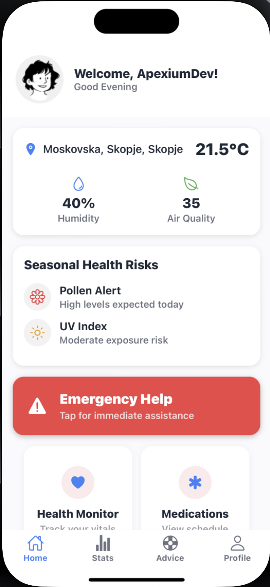
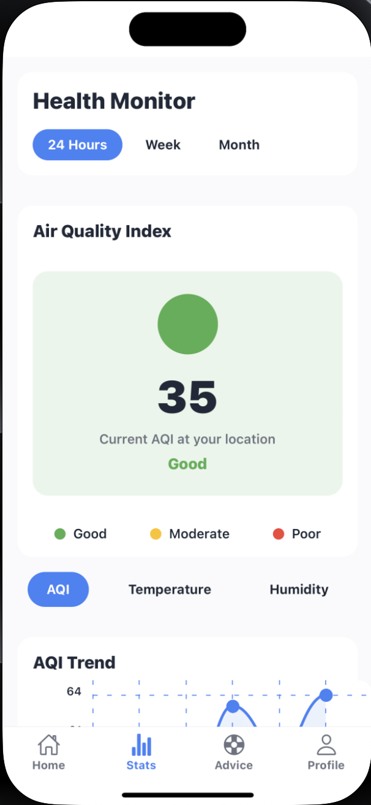
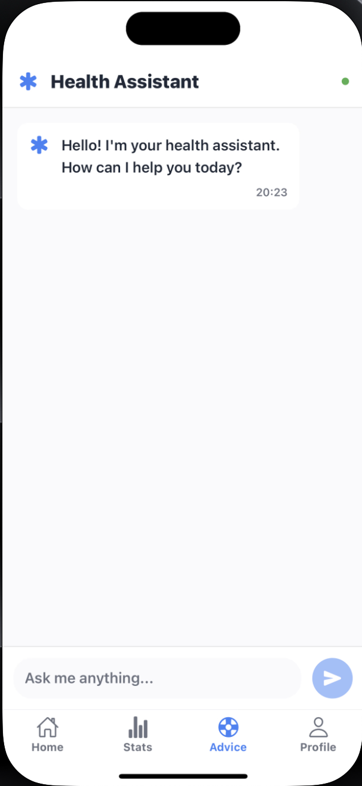
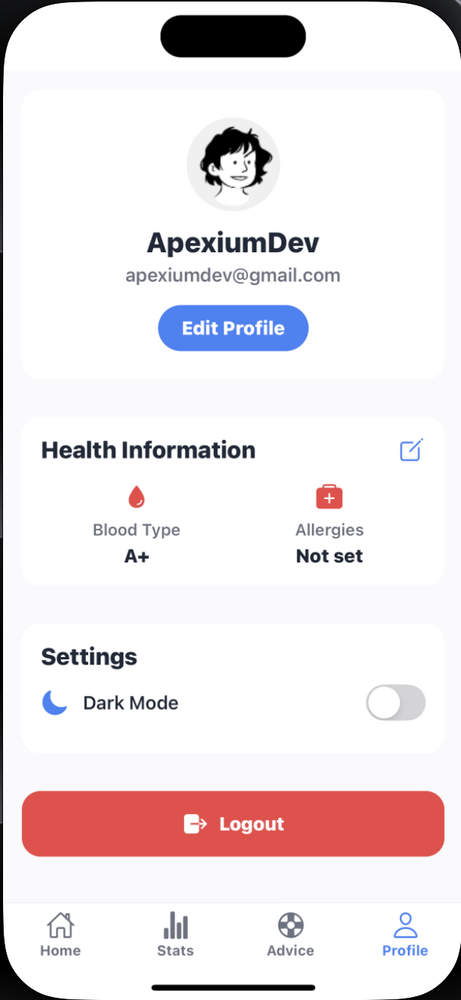

# Rengen: Health Monitoring & Emergency Response System

Rengen is a comprehensive health monitoring application designed to track seasonal health risks and provide personalized recommendations to keep users healthy year-round. With integrated emergency response features, Rengen offers peace of mind alongside proactive health management.

## Overview

Rengen combines modern mobile technology with health monitoring capabilities to create a seamless user experience. Built with React Native and Expo, the application offers cross-platform support while maintaining native performance and feel.

### Gallery

<p align="center">
  
  
  
  
</p>


### Problem

Traditional health applications often focus solely on fitness tracking or medical records, leaving gaps in comprehensive health monitoring and emergency response. Most applications fail to account for seasonal health variations and don't provide actionable insights based on environmental factors or personal health data.

### Solution

Rengen addresses these challenges by providing:  
- Seasonal health risk assessment and recommendations  
- Integrated emergency services with real-time tracking  
- Comprehensive health monitoring with actionable insights  
- User-friendly interface with both light and dark modes  
- Secure data management and authentication  

## Features

- 🌡️ **Seasonal Health Monitoring**: Track health risks associated with changing seasons and receive personalized recommendations  
- 🚨 **Emergency Services**:  
  - Location-based emergency number identification  
  - Real-time emergency response tracking  
  - Quick access to emergency contacts  
  - Emergency medical information sharing  
- 👤 **User Profile Management**: Comprehensive health profile with medical history and conditions  
- 📊 **Health Analytics**: Visualize health trends and patterns over time  
- 🔐 **Secure Authentication**: Protect sensitive health information with robust security measures  
- 🌙/☀️ **Accessibility**: Toggle between dark and light modes for comfortable viewing  
- 📱 **Cross-Platform Support**: Available on both iOS and Android devices  

## Tech Stack

### Frontend  
- React Native / Expo framework  
- TypeScript for type safety  
- Firebase Authentication & Firestore  
- React Navigation for seamless screen transitions  
- Redux for state management  

### Backend  
- Node.js runtime environment  
- Express.js web framework  
- WebSocket for real-time communication  
- MongoDB for emergency and health data storage  

## Project Structure

```
rengen/
├── app/ # React Native frontend application
├── backend/ # Server-side code
│ └── emergency-webapp/ # Emergency response dashboard
├── data/ # Application data (not tracked in git)
└── assets/ # Static assets (images, fonts, etc.)
```


## Prerequisites

Before you begin, ensure you have the following installed:  
- Node.js (v14.0.0 or later)  
- npm or Yarn package manager  
- Expo CLI (`npm install -g expo-cli`)  
- MongoDB (for backend development)  
- iOS Simulator or Android Emulator (optional for mobile testing)  

## Installation and Setup

### Frontend Setup

Clone the repository
```
git clone https://github.com/Apexium-Dev/Rengen.git
cd Rengen
```
Install dependencies
```
npm install
```
Start the development server
```
npx expo start
```

### Backend Setup

Navigate to backend directory
```
cd backend/emergency-webapp
```
Install backend dependencies
```
npm install
```
Start the backend server
```
node server.js
```

## License

This project is licensed under the MIT License - see the LICENSE file for details. 

## Acknowledgments

- The Apexium Development Team  
- Healthcare professionals who provided domain expertise  
- Open source libraries and frameworks that made this project possible  

---

Built with ❤️ by Apexium-Dev
